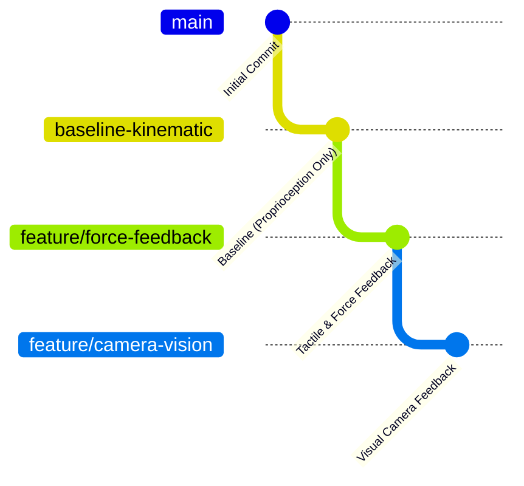

# Hands Catching Ball in Isaac Lab (Reinforcement Learning)

A cooperative Reinforcement Learning environment built on top of **NVIDIA Isaac Lab** (Direct Workflow), where two robotic **Shadow Dexterous Hands** face each other across a 1.0-meter gap and learn to dynamically **throw and catch a ball**.

---

## 📌 Project Overview

* **Task Name:** `Template-Catching-Ball-Rl-Direct-v0`
* **Robots:** 2× Anthropomorphic Shadow Hands (20 actuated DOFs per hand = 40 total action dimensions).
* **Object:** Rigid sphere ($r = 3.35\text{ cm}$, tennis ball size, $500\text{ kg/m}^3$).
* **Physics & Framework:** NVIDIA Isaac Lab `DirectMARLEnv` with GPU-accelerated PhysX tensors and `rl_games` PPO.
* **Challenge:** The hand bases are fixed 1.0 meter apart. Since physical reach is limited to ~25–30 cm per hand, the hands cannot perform a static handover; the right hand must fling the ball across open air, and the left hand must catch and stabilize it in the target zone before it falls to the ground ($z \le 0.24\text{ m}$).

---

## 🌿 Repository Branch Structure

This project is structured into three experimental branches to study the impact of different sensory modalities on dynamic manipulation:



1. **`baseline-kinematic` (Current Branch):**
   * Baseline model relying strictly on joint kinematics and ground-truth positions/velocities.
   * No tactile/force sensors and no vision cameras.

2. **`feature/force-feedback`:**
   * Equips Shadow Hand fingertips and palm links with `ContactSensor` instances.
   * Incorporates net 3D contact force feedback into observations and shapes rewards for compliant, soft catches.

3. **`feature/camera-vision`:**
   * Integrates RGB/Depth cameras (`TiledCamera`) to feed visual stream observations directly to the policy network.

---

## ⚙️ Prerequisites & Installation

### 1. Requirements
* **NVIDIA Isaac Lab** (follow the official [Isaac Lab Installation Guide](https://isaac-sim.github.io/IsaacLab/main/source/setup/installation/index.html)).
* Ubuntu 20.04 / 22.04 LTS with an NVIDIA RTX GPU (e.g. RTX 3080/4090) and CUDA 11.8 / 12.x.
* Conda or Python virtual environment with Isaac Lab installed.

### 2. Install Extension in Editable Mode
Clone this repository and install it into your active Isaac Lab Python environment:

```bash
cd ~/Catching_ball_RL

# Activate your Isaac Lab environment (e.g., conda activate isaaclab)
python -m pip install -e source/Catching_ball_RL
```

### 3. Verify Environment Registration
```bash
python scripts/list_envs.py
```

---

## 🚀 Running the Project

### 1. Training (RL-Games PPO)
To train the centralized policy across 2048 parallel vectorized environments:

```bash
# Headless mode (Recommended - 10x-20x faster, saves GPU VRAM)
python scripts/rl_games/train.py --task=Template-Catching-Ball-Rl-Direct-v0 --num_envs=2048 --headless
```

* **Training Time:** ~55–75 minutes on an NVIDIA RTX 3080 for 5000 epochs.
* **Auto-saving:** Checkpoints are continuously saved in `logs/rl_games/shadow_hand_over/<timestamp>/nn/shadow_hand_over.pth`.

### 2. Live Monitoring with TensorBoard
In a separate terminal, monitor training curves (rewards, episode lengths, goal distance):

```bash
python -m tensorboard.main --logdir=logs/rl_games/shadow_hand_over
```
Open **`http://localhost:6006`** in your browser.

### 3. Visualizing / Playing a Checkpoint
To view the trained policy in the Omniverse GUI viewport:

```bash
# Automatically load the best/latest saved model
python scripts/rl_games/play.py --task=Template-Catching-Ball-Rl-Direct-v0 --use_last_checkpoint --num_envs=16

# Or specify a checkpoint path explicitly
python scripts/rl_games/play.py --task=Template-Catching-Ball-Rl-Direct-v0 --checkpoint=logs/rl_games/shadow_hand_over/<RUN_DIR>/nn/shadow_hand_over.pth --num_envs=16
```

### 4. Quick Sanity Check (No Checkpoint Needed)
To test the environment physics and scene setup without a trained model:

```bash
# Random action agent
python scripts/random_agent.py --task=Template-Catching-Ball-Rl-Direct-v0 --num_envs=16

# Zero action agent (neutral pose)
python scripts/zero_agent.py --task=Template-Catching-Ball-Rl-Direct-v0 --num_envs=16
```

---

## 📁 Repository Structure

```
├── README.md                                # Project documentation
├── scripts/
│   ├── rl_games/
│   │   ├── train.py                         # Training script using RL-Games PPO
│   │   └── play.py                          # Policy replay and evaluation script
│   ├── list_envs.py                         # Lists registered tasks
│   ├── random_agent.py                      # Dummy agent for physics sanity check
│   └── zero_agent.py                        # Zero action agent
├── source/Catching_ball_RL/
│   └── Catching_ball_RL/
│       └── tasks/direct/catching_ball_rl/
│           ├── shadow_hand_over_env.py      # Core environment logic (DirectMARLEnv)
│           ├── shadow_hand_over_env_cfg.py  # Environment, robot, and domain randomization cfg
│           └── agents/
│               └── rl_games_ppo_cfg.yaml    # PPO hyperparameter configuration
```